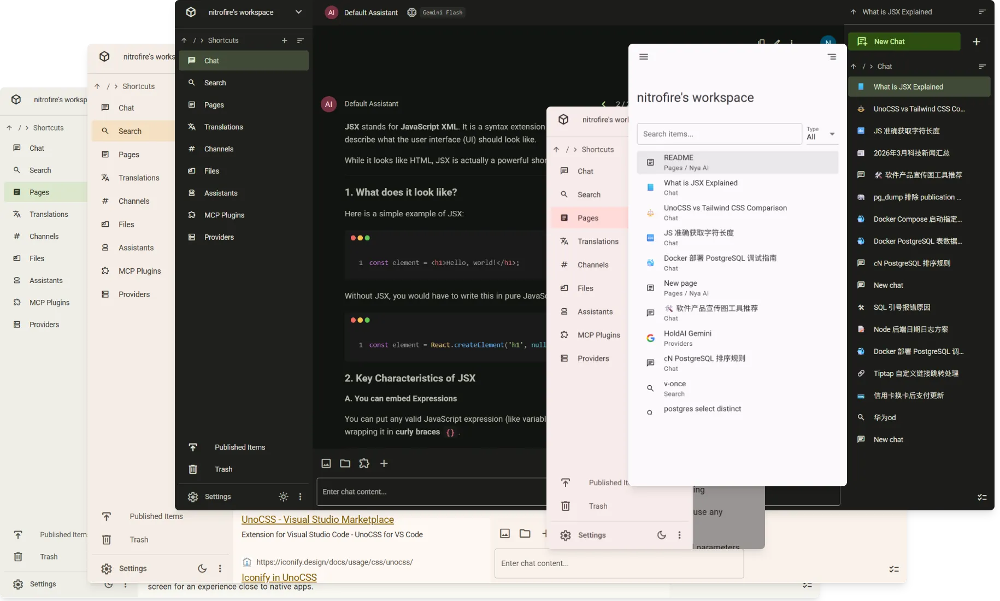

# Nya AI



English | [简体中文](README.zh-CN.md) | [SaaS](https://nyaai.cc) | [Docs](https://docs.nyaai.cc) | [Ask Zread](https://zread.ai/NitroRCr/nyaai)

Nya AI combines AI chat client and collaboration platform, enabling you to chat with AI, search the web, take notes, write documents, communicate/collaborate with your team, manage files, and more within one unified workspace.

## First-class AI Chat

Unlike the added AI features of other collaboration platforms, AI Chat is our core feature, designed to fully replace standalone AI chat apps.

- Message Branching: Switch between multiple branches
- Document Input: Parse .docx, .pdf, .pptx, etc., into text input
- MCP: Connect to MCP servers to extend AI capabilities, supporting MCP Tools, Resources, and Prompts
- Multimodal Input/Output: Support for models like Nano Banana
- Web Search & Crawl: Built-in extensions for web search and web page crawling
- BYOK: Add custom providers to use any custom models
- Detailed configuration for model parameters and provider options
- User input preview, message TOC, quick scrolling, keyboard shortcuts, and other detailed features

## Workspaces

The workspace has a file system-like storage structure, allowing you to create folders and flexibly organize various types of content according to a custom structure.

The workspace is also a place for collaboration. You can create new workspaces, invite your team to join your workspace, manage roles of workspace members, and more. All members of the workspace can browse and edit the workspace content. All members of the workspace share the workspace's AI quota and storage space.

## One-Stop Knowledge Base

Supports full-text search across workspace content, including chat messages, channel messages, page content, translations, and file (document) content.

Meanwhile, AI can also search this content via the "Workspace Search" plugin to enable workspace RAG.

## Access anytime, anywhere

All content is stored in the cloud, allowing you to access everything from any device at any time. Thanks to [Zero](https://github.com/rocicorp/mono?tab=readme-ov-file#zero), we achieved this while enabling live queries and optimistic mutations, delivering an interaction experience close to local-first applications!

Thanks to our responsive interface design, mobile devices can also access Nya AI directly. It's also a PWA; you can install it to your home screen for an experience close to native apps.

## Pages

Notion-like collaborative pages with support for:

- **Comprehensive Markdown Support:** Input using Markdown syntax, paste Markdown content directly, or export as Markdown.
- **Docx Support:** Import from or export to Docx files.
- **Version Control:** Browse and revert to historical versions at any time.
- **AI Integration:** Open an AI chat in the right side to ask questions or have the AI edit the page for you.

## Publishing Content

Pages, chats, files, and more can all be published (**Right-click** an item in the right sidebar -> **Publish**). Once published, they are publicly accessible via the link (read-only). Sub-items of a published item will also be published automatically.

## Files

Nya AI can also be your cloud drive. Uploading files here brings the following benefits:

- **Universal Access:** Access your files anytime from any device.
- **Seamless Integration:** Use files within chats or pages at any time.
- **Flexible Sharing:** Share publicly or via direct download links.
- **Full-Text Search:** Search the contents of your files (for parseable file types).

While this feature is primarily designed for documents, we do not restrict file types, provided they do not exceed the size limit.

## More

Search, channels, translation... Learn more features by [getting started](https://nyaai.cc)!

## Self host

Please refer to [Self-hosting](https://docs.nyaai.cc/self-host).

## Development

```sh
# Copy and udpate .env
cp .env.example .env

# Install dependencies
bun install

# Prepare for linting, type-checking, etc
bun quasar prepare

# Startup dev db
bun dev:db-up

# Startup dev server
bun dev:server

# zero-cache is not yet compatible with bun; run it with node.
npm i -g @rocicorp/zero
zero-cache-dev

# Dev user frontend
bun dev:frontend

# Dev admin frontend
bun dev:admin
```

## Community Links

- [Linux Do](https://linux.do/t/topic/1787694)
