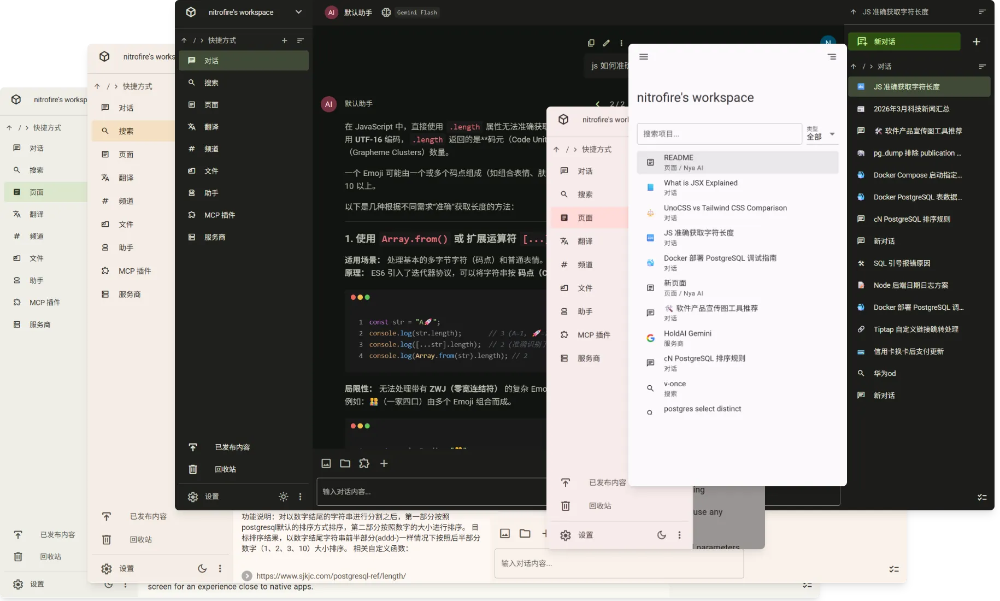

# Nya AI

[![zread](https://img.shields.io/badge/Ask_Zread-_.svg?style=flat&color=00b0aa&labelColor=000000&logo=data%3Aimage%2Fsvg%2Bxml%3Bbase64%2CPHN2ZyB3aWR0aD0iMTYiIGhlaWdodD0iMTYiIHZpZXdCb3g9IjAgMCAxNiAxNiIgZmlsbD0ibm9uZSIgeG1sbnM9Imh0dHA6Ly93d3cudzMub3JnLzIwMDAvc3ZnIj4KPHBhdGggZD0iTTQuOTYxNTYgMS42MDAxSDIuMjQxNTZDMS44ODgxIDEuNjAwMSAxLjYwMTU2IDEuODg2NjQgMS42MDE1NiAyLjI0MDFWNC45NjAxQzEuNjAxNTYgNS4zMTM1NiAxLjg4ODEgNS42MDAxIDIuMjQxNTYgNS42MDAxSDQuOTYxNTZDNS4zMTUwMiA1LjYwMDEgNS42MDE1NiA1LjMxMzU2IDUuNjAxNTYgNC45NjAxVjIuMjQwMUM1LjYwMTU2IDEuODg2NjQgNS4zMTUwMiAxLjYwMDEgNC45NjE1NiAxLjYwMDFaIiBmaWxsPSIjZmZmIi8%2BCjxwYXRoIGQ9Ik00Ljk2MTU2IDEwLjM5OTlIMi4yNDE1NkMxLjg4ODEgMTAuMzk5OSAxLjYwMTU2IDEwLjY4NjQgMS42MDE1NiAxMS4wMzk5VjEzLjc1OTlDMS42MDE1NiAxNC4xMTM0IDEuODg4MSAxNC4zOTk5IDIuMjQxNTYgMTQuMzk5OUg0Ljk2MTU2QzUuMzE1MDIgMTQuMzk5OSA1LjYwMTU2IDE0LjExMzQgNS42MDE1NiAxMy43NTk5VjExLjAzOTlDNS42MDE1NiAxMC42ODY0IDUuMzE1MDIgMTAuMzk5OSA0Ljk2MTU2IDEwLjM5OTlaIiBmaWxsPSIjZmZmIi8%2BCjxwYXRoIGQ9Ik0xMy43NTg0IDEuNjAwMUgxMS4wMzg0QzEwLjY4NSAxLjYwMDEgMTAuMzk4NCAxLjg4NjY0IDEwLjM5ODQgMi4yNDAxVjQuOTYwMUMxMC4zOTg0IDUuMzEzNTYgMTAuNjg1IDUuNjAwMSAxMS4wMzg0IDUuNjAwMUgxMy43NTg0QzE0LjExMTkgNS42MDAxIDE0LjM5ODQgNS4zMTM1NiAxNC4zOTg0IDQuOTYwMVYyLjI0MDFDMTQuMzk4NCAxLjg4NjY0IDE0LjExMTkgMS42MDAxIDEzLjc1ODQgMS42MDAxWiIgZmlsbD0iI2ZmZiIvPgo8cGF0aCBkPSJNNCAxMkwxMiA0TDQgMTJaIiBmaWxsPSIjZmZmIi8%2BCjxwYXRoIGQ9Ik00IDEyTDEyIDQiIHN0cm9rZT0iI2ZmZiIgc3Ryb2tlLXdpZHRoPSIxLjUiIHN0cm9rZS1saW5lY2FwPSJyb3VuZCIvPgo8L3N2Zz4K&logoColor=ffffff)](https://zread.ai/NitroRCr/nyaai)



[English](README.md) | 简体中文

Nya AI 结合了 AI 对话客户端和协作平台，让你能够在一个统一的工作空间中进行 AI 对话、网络搜索、记笔记、编写文档、与团队沟通/协作、管理文件等操作。

## 一流的 AI 对话

与其他协作平台中附加的 AI 功能不同，AI 对话是我们的核心功能，旨在完全取代单独的 AI 对话客户端。

- 消息分支：在多个分支之间切换
- 文档输入：将 .docx、.pdf、.pptx 等解析为文本输入
- MCP：连接 MCP 服务器以扩展 AI 功能，支持 MCP Tools、Resources 和 Prompts
- 多模态输入/输出：支持 Nano Banana 等模型
- 网络搜索与爬取：内置网页搜索和网页爬取的扩展
- BYOK：添加自定义服务商以使用任何自定义模型
- 具体的模型参数和服务商选项配置
- 用户输入预览、消息 TOC、快速滚动、键盘快捷键及其他细节功能

## 工作区

工作区拥有类似文件系统的储存结构，你可以创建文件夹，按照自定义的结构灵活地组织各种类型的内容。

工作区也是协作的地方，你可以创建新的工作区，邀请你的团队加入你的工作区，管理工作区成员的角色等。工作区的所有成员都可以浏览、编辑工作区的内容。工作区的所有成员共享工作区的 AI 额度和储存空间。

## 一站式知识库

支持在工作区内容中进行全文搜索，包括对话消息、频道消息、页面内容、翻译内容、文件（文档类型）内容。

同时 AI 也可以通过“工作区搜索”插件搜索这些内容，实现工作区 RAG。

## 随时随地访问

所有内容都储存在云端，你可以随时通过任意设备访问所有内容。得益于 [Zero](https://github.com/rocicorp/mono?tab=readme-ov-file#zero)，我们得以在实现这一切的同时实现实时查询和乐观突变，达到接近本地优先应用的交互体验！

得益于响应式的界面设计，移动端也能够直接访问。本应用也是 PWA，你可以将其安装至主屏幕以获得接近原生应用的体验。

## 页面

类 Notion 的可协作页面，支持：

- 完善的 Markdown 支持：使用 Markdown 语法输入、粘贴 Markdown、导出为 Markdown
- Docx 支持：从 Docx 文件导入 / 导出为 Docx
- 版本控制：可随时浏览、退回到历史版本
- AI 集成：可在右侧打开 AI 对话，向 AI 提问或是让 AI 编辑页面

## 发布内容

页面、对话、文件等都可以发布（在右侧边栏**右键**项目->**发布**），发布后可通过该链接公开访问（只读），发布的项目的子项目也会随之发布。

## 文件

Nya AI 也可以是你的网盘。将文件上传至这里有以下好处：

- 可随时从任意设备访问
- 可随时在对话/页面中使用
- 可公开分享或使用下载链接分享
- 文档类型文件自动解析为文本，以便全文搜索

此功能主要为文档类型文件设计，但我们并没有限制上传的文件类型，只要文件大小不超过上限即可。

## 更多

搜索、频道、翻译... 通过 [开始使用](https://nyaai.cc) 来了解更多功能！

## 文档

我们尚未建立文档，不过你可以在 [Zread](https://zread.ai/NitroRCr/nyaai) 询问 AI 来了解项目的更多细节。

## 自部署

请参考 [docker-compose.example.yml](docker-compose.example.yml)。

## 开发

```sh
# Copy and udpate .env
cp .env.example .env

# Install dependencies
bun install

# Prepare for linting, type-checking, etc
bun quasar prepare

# Startup dev db
bun dev:db-up

# Startup dev server
bun dev:server

# zero-cache is not yet compatible with bun; run it with node.
npm i -g @rocicorp/zero
zero-cache-dev

# Dev user frontend
bun dev:frontend

# Dev admin frontend
bun dev:admin
```

## 社区链接

- [Linux Do](https://linux.do/t/topic/1787694)
